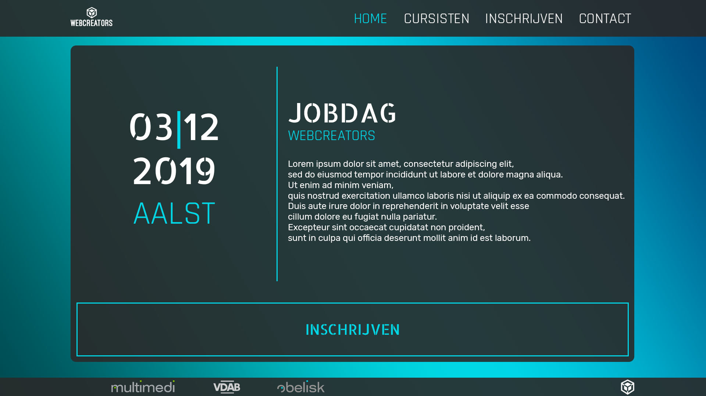

# jobdagAalst
***deadline: 25/10***

| index | cursisten | inschrijving | contact | privacy |
|-------|-----------|--------------|---------|---------|
| nav | nav | nav | nav | |
| welcomeHeader | grid cards | form | form | content |
| footer | footer | footer |  footer | |



bg:
```css
body {
height: 100vh;
}
.bg{
    min-height: 100%;
    background-image: repeating-linear-gradient(to top right, $tealDark, $teal, $tealBlue);
}
```
font:
```css
<link href="https://fonts.googleapis.com/css?family=Allerta+Stencil|Rajdhani|Rubik&display=swap" rel="stylesheet">

$fontRajdhani: "Rajdhani", sans-serif;
$fontAllerta: "Allerta Stencil", sans-serif;
$fontRubik: "Rubik", sans-serif; 
```

| Rajdhani | Allerta Stencil | Rubik |
|----------|-----------------|-------|
| nav | h1, h3, a | h2, h4, p |

color:
```css
$black: #000;
$grey: rgb(41, 41, 41);
$greyT: rgba(41, 41, 41, 0.9);
$white: #fff;
$anthraciet: #292929;
$tealDark: rgb(0, 76, 82);
$teal: rgb(0, 215, 230);
$tealBlue: rgb(0, 70, 123);
```
